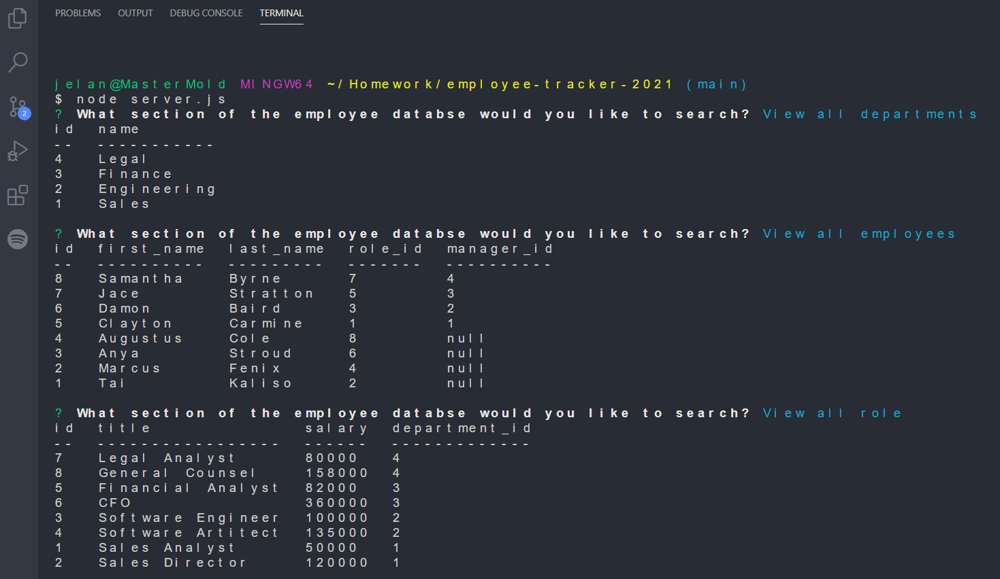
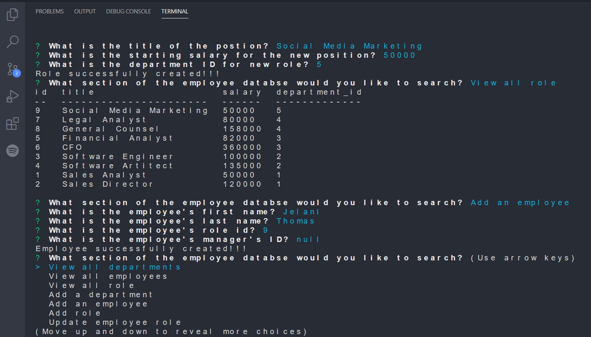

# Employee Tracker

  ## Description
  Developers are often tasked with creating interfaces that make it easy for non-developers to view and interact with information stored in databases. As the developer I wanted to architect and build a solution for managing a company's employees using node, inquirer, and MySQL.

<hr>

  ## Table of contents
  - [Installation](#installation)
  - [Usage](#usage)
  - [Credit](#credit)
  - [Tests](#tests)
  - [GitHub](#github)
  - [Email](#email)
  - [Questions](#questions)
  - [License](#license)
  <hr>

  ## Installation

  To execute this code run these in your terminal to install the needed dependecies:
  ```
  npm int
  ```
  ```
  npm i
  ```
  ```
  npm i inquirer
  ```
  ```
  npm i mysql
  ```
  
  <hr>

  ## Usage

Running the following command in your terminal will start the inquirer prompt:
  ```
  node server.js
  ```
  
  Making a selection using the arrow keys and the enter key will allow you to select the query you'd like to run. Below are some examples of what you terminal will look like:


**View tables**


  

  

  **Add to tables**

  


  <hr>

  ## Credit
  Jelani Thomas

  ## Tests
  No tests included

  ## GitHub
  [GeloneJT](https://github.com/GeloneJT)

  ## Email
  jelani13@icloud.com

  ## Questions
  The link [here](https://youtu.be/__YJy5MsSNI) shows the full demo from server initiliaztion, CLI  inputs, to what each table looks in the terminal after each query prompt.
  Any further questions needed in regards to this application or any other repo feel free to contact me via my email or GitHub given above

<hr>

  ## License
  [](https://opensource.org/licenses/MIT)
